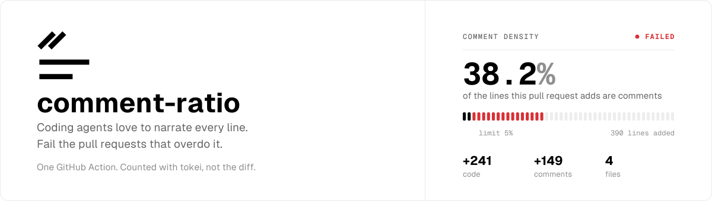

<div align="center">

<picture>
  <source media="(prefers-color-scheme: dark)" srcset=".github/assets/banner-dark.svg">
  
</picture>

**Fail pull requests that add too many comments.**

Coding agents love to narrate every line. This action counts the code and comment lines a pull
request adds with [tokei](https://github.com/XAMPPRocky/tokei), and fails the check when comments
take up more than their share.

[](https://github.com/IgnaceMaes/comment-ratio/actions/workflows/ci.yml)
[](https://github.com/IgnaceMaes/comment-ratio/releases)
[](https://github.com/marketplace/actions/comment-ratio)
[](LICENSE)

</div>

---

## Quick start

```yaml
# .github/workflows/comment-density.yml
name: Comment density

on:
  pull_request:

permissions:
  contents: read
  pull-requests: write # to post the report comment

jobs:
  comments:
    runs-on: ubuntu-latest
    steps:
      - uses: actions/checkout@v5
      - uses: IgnaceMaes/comment-ratio@v1
        with:
          max-comment-density: 25 # at most 1 in 4 added lines may be a comment
```

That's it. On every pull request the action:

1. Downloads a pinned tokei binary (cached on the runner).
2. Lists the files the pull request changes and counts code and comment lines in each file
   **before** and **after** the change.
3. Sums the per-file increases into "code added" and "comments added".
4. Fails the job when `comments added / (code added + comments added)` is above
   `max-comment-density`.

### What you get

Every run writes a job summary and keeps one comment on the pull request up to date:

> ## ❌ Comment Density: Failed
>
> 38.2% of the added lines are comments (149 of 390); the limit is 25%.
>
> |             | Code | Comments |
> | :---------- | ---: | -------: |
> | **Added**   | +241 |     +149 |
> | **Removed** |  −42 |       −3 |
> | **Net**     | +199 |     +146 |
>
> **Comment density** 38.2% · **Limit** 25%
>
> <details><summary>4 files analyzed</summary>
>
> | File                      | Language   | Code Δ | Comments Δ |  Density |
> | :------------------------ | :--------- | -----: | ---------: | -------: |
> | `src/scheduler/queue.ts`  | TypeScript |   +153 |       +131 | 46.1% ⚠️ |
> | `src/scheduler/worker.ts` | TypeScript |    +88 |        +15 |    14.6% |
> | `src/index.ts`            | TypeScript |      0 |         +3 |  100% ⚠️ |
> | `src/legacy/poll.ts`      | TypeScript |    −42 |         −3 |        – |
>
> </details>
>
> <sub>Density is the share of comment lines among all lines added. Lines are counted per changed file before and after the change; positive deltas are summed. Comparing `4f2c1a9…b81e0d3`, counted with tokei 12.1.2.</sub>

Files that exceed the limit on their own also get a warning annotation in the **Files changed** tab.

## Inputs

| Input                 | Default                                                       | Description                                                                                                                                      |
| :-------------------- | :------------------------------------------------------------ | :----------------------------------------------------------------------------------------------------------------------------------------------- |
| `max-comment-density` | `25`                                                          | Maximum share of added lines that may be comments, in percent. `25` or `25%` both work. The job fails when the density is **above** this value.  |
| `min-lines-added`     | `50`                                                          | Skip the check when fewer lines (code plus comments) were added. Keeps a three-line fix with one comment from failing on a technicality.         |
| `include`             | _all files_                                                   | Newline-separated globs. When set, only matching paths are analyzed.                                                                             |
| `exclude`             | _none_                                                        | Newline-separated globs to ignore (generated code, vendored dependencies, fixtures).                                                             |
| `languages`           | _all languages_                                               | Comma- or newline-separated [tokei language names](https://github.com/XAMPPRocky/tokei#supported-languages) to analyze, e.g. `TypeScript, Rust`. |
| `exclude-languages`   | `Markdown, Plain Text, ReStructuredText, AsciiDoc, Org, Djot` | Languages to ignore. tokei counts prose as comments, so docs are excluded by default. Pass `none` to include everything.                         |
| `fail-on-threshold`   | `true`                                                        | Set to `false` to report without failing the job.                                                                                                |
| `comment`             | `true`                                                        | Post and keep updating a sticky comment on the pull request.                                                                                     |
| `github-token`        | `${{ github.token }}`                                         | Token used to comment and to resolve the merge base through the API.                                                                             |
| `tokei-version`       | `12.1.2`                                                      | tokei release to download, or `system` to use a tokei already on `PATH`. See [tokei versions](#tokei-versions).                                  |
| `base` / `head`       | _from the event_                                              | Commit-ish pair to compare. Required for events that carry no range (e.g. `workflow_dispatch`).                                                  |

## Outputs

| Output            | Example                | Description                                                                       |
| :---------------- | :--------------------- | :-------------------------------------------------------------------------------- |
| `code-added`      | `241`                  | Code lines added (sum of positive per-file deltas).                               |
| `comments-added`  | `149`                  | Comment lines added.                                                              |
| `comment-density` | `38.21`                | Share of added lines that are comments, in percent with two decimals.             |
| `status`          | `pass`, `fail`, `skip` | Outcome of the check. `skip` means below `min-lines-added` or no countable files. |
| `passed`          | `true` / `false`       | `false` only when the limit was exceeded (regardless of `fail-on-threshold`).     |
| `report`          | Markdown               | The full report, for use in other steps.                                          |

## How it works

tokei classifies every line of a file as code, comment or blank, and it understands
block comments, docstrings, nested comments and embedded languages (JavaScript inside HTML,
code fences inside Markdown). Diffs alone can't do that: a `+` line in the middle of a
`/* ... */` block looks like code to `git diff`.

So instead of reading the diff, the action reads the **file contents on both sides** of it:

```
                git diff --raw  base...head
                         │
          ┌──────────────┴──────────────┐
          ▼                             ▼
   base blobs ─▶ tokei          head blobs ─▶ tokei
   { code, comments }           { code, comments }
          └──────────────┬──────────────┘
                         ▼
        per file:  Δcode = head.code − base.code
                   Δcomments = head.comments − base.comments

        totals:    code added     = Σ max(Δcode, 0)
                   comments added = Σ max(Δcomments, 0)
                   density        = comments added / (code added + comments added)
```

Only changed files are materialized, so the run takes seconds even on large repositories.
Renames are followed, deletions count as removals, and symlinks and submodules are skipped.

The base of the comparison is the **merge base** of the pull request, so a branch that lags
behind `main` is not blamed for changes it didn't make. The action fetches the commits it needs on
its own; the default shallow `actions/checkout` is fine.

### Choosing a limit

Density is "comment lines as a share of all lines added". Some reference points:

| Density | What it looks like                                                          |
| ------: | :-------------------------------------------------------------------------- |
|     10% | Terse. A comment every ten lines, usually a doc comment per function.       |
|     25% | The default. Doc comments on public APIs plus the occasional "why" comment. |
|     40% | Every other statement has a comment. Typical unedited agent output.         |

A pull request that only adds comments has a density of 100% and fails; one that only removes
comments has a density of 0% and passes. Both are on purpose.

## Recipes

### Only check application code

```yaml
- uses: IgnaceMaes/comment-ratio@v1
  with:
    include: |
      src/**
      packages/*/src/**
    exclude: |
      **/*.test.ts
      **/*.generated.*
      **/__snapshots__/**
```

### Only a few languages

```yaml
- uses: IgnaceMaes/comment-ratio@v1
  with:
    languages: TypeScript, TSX, Rust
```

### Report without blocking

Useful while a team is easing into the rule. The comment and job summary still appear, and
`outputs.passed` still reflects the verdict.

```yaml
- uses: IgnaceMaes/comment-ratio@v1
  with:
    fail-on-threshold: false
```

### Use the outputs

```yaml
- uses: IgnaceMaes/comment-ratio@v1
  id: comments
  with:
    fail-on-threshold: false
- if: steps.comments.outputs.status == 'fail'
  run: echo "::notice::${{ steps.comments.outputs.comment-density }}% of added lines are comments."
```

### Push events and manual runs

For `push` events the action compares `before...after` of the push. For events without a range,
pass one explicitly:

```yaml
on:
  workflow_dispatch:
    inputs:
      base: { required: true }
      head: { required: true }

jobs:
  comments:
    runs-on: ubuntu-latest
    steps:
      - uses: actions/checkout@v5
      - uses: IgnaceMaes/comment-ratio@v1
        with:
          base: ${{ inputs.base }}
          head: ${{ inputs.head }}
          comment: false
```

### tokei versions

tokei publishes prebuilt binaries for `12.1.2` only, so that is the default. Newer releases
add languages and fixes but must be built from source. To use one, install it in a previous
step and point the action at it:

```yaml
- uses: taiki-e/install-action@v2
  with:
    tool: tokei@15.0.0
- uses: IgnaceMaes/comment-ratio@v1
  with:
    tokei-version: system
```

The action works with tokei 12 through 15 (the JSON schema is the same).

## FAQ

**Why are Markdown and other docs excluded by default?**
tokei counts every line of prose as a comment. A README edit would otherwise push the density up
and fail a perfectly fine pull request. Set `exclude-languages: none` to include them anyway.

**Does it work for pull requests from forks?**
Yes. The check runs with the read-only token forks receive; only the comment is skipped (with a
warning in the log). Use `pull_request_target` if you need the comment on fork pull requests,
and understand [its security implications](https://securitylab.github.com/research/github-actions-preventing-pwn-requests/) first.

**Does moving code around count as "added"?**
A pure rename is detected by git and contributes nothing. Moving a function from one file to
another counts the destination file's increase, so moved code is judged on its comments the same
as new code.

**Which lines are "comments"?**
Whatever tokei says: line comments, block comments, doc comments and docstrings. Commented-out
code is a comment too; this action doesn't try to tell the difference.

**Can it enforce a minimum instead?**
Not today. The action was built to catch over-commented changes, so the limit is a maximum.

**Can I run it on macOS or Windows runners?**
Yes. Prebuilt tokei binaries exist for Linux (x64, arm64), macOS (Apple Silicon runs the x64
build through Rosetta) and Windows (x64).

## Contributing

Bug reports and pull requests are welcome. See [CONTRIBUTING.md](CONTRIBUTING.md) for the
development setup and release process.

## License

[MIT](LICENSE)
